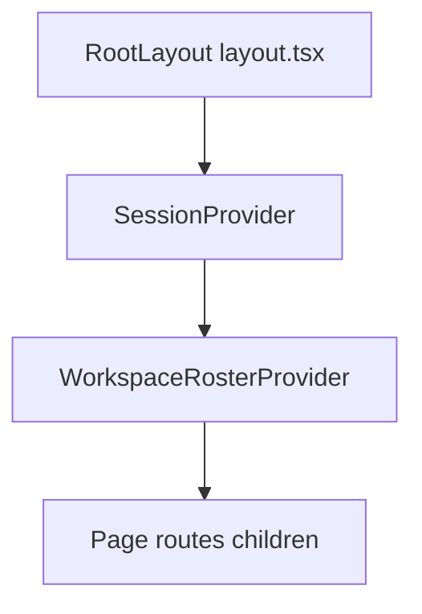

# Site-wide component and architecture audit

**Audience:** Designers and implementers of an **admin portal** (or external tools like ChatGPT) who need a faithful map of the existing **HireFlow / Nojoblem** web app without reading the whole repo.

**Scope:** Next.js App Router app under `web/` (`package.json` name: `web`). This document inventories routes, API handlers, React components, global providers, data sources, authentication, database models, and external integrations.

---

## 1. Purpose and product naming

The UI uses mixed branding in metadata:

- **HireFlow** — home, dashboard, team, integrations, marketplace, schedules, skill detail titles.
- **Nojoblem** — workspace page title/subcopy.

Treat these as the same product surface unless you split brands intentionally in an admin UI.

---

## 2. Tech stack and conventions

| Layer | Choice |
| --- | --- |
| Framework | **Next.js 16** (App Router) |
| UI | **React 19**, **Tailwind CSS 4** |
| Fonts | **Geist** / **Geist Mono** (`src/app/layout.tsx`) |
| Auth | **NextAuth v4**, JWT sessions, **Credentials** provider (`src/auth.ts`) |
| Database | **Prisma 6** + **SQLite** (`prisma/schema.prisma`, `DATABASE_URL`) |
| Markdown | `react-markdown`, `remark-gfm`, `rehype-highlight`, `rehype-sanitize` (skill docs) |
| Charts | `recharts` (if used by feature components) |
| Tests | **Vitest** (`npm run test`) |

**Path alias:** `@/` → `src/` (see `tsconfig.json`).

---

## 3. Route map (App Router)

| Route | File | Role |
| --- | --- | --- |
| `/` | `src/app/page.tsx` | Minimal landing: title “HireFlow”, CTA link to `/dashboard`. |
| `/dashboard` | `src/app/dashboard/page.tsx` | **Agent work board**: `TopNav`, `DashboardTeamAgentsClient`, `SmartSuggestionsPanel`, `SuggestedAgentsCard`, `JobBoard`. |
| `/workspace` | `src/app/workspace/page.tsx` | **Agent workspace** (chat): `TopNav`, `CollaboratorStrip`, `WorkspaceShell` inside `Suspense`. **Requires sign-in** (middleware). |
| `/team` | `src/app/team/page.tsx` | **My Agent Team**: `TopNav`, `TeamPageView`. Query: `?empty=1` empty roster demo; `?create=1` scroll to create agent. |
| `/integrations` | `src/app/integrations/page.tsx` | Integrations catalog: `TopNav`, `IntegrationsView`. |
| `/marketplace` | `src/app/marketplace/page.tsx` | **Agent skills** from bundled JSON: `TopNav`, `MarketplaceView` + `agencyAgents.json`. |
| `/schedules` | `src/app/schedules/page.tsx` | **Scheduled jobs**: `TopNav`, `AgentScheduleCalendar` in `Suspense`. |
| `/skills/[skillId]` | `src/app/skills/[skillId]/page.tsx` | Skill detail: resolves importable vs agency skills, `SkillMarkdownDoc` for bundled markdown, `SkillAssignmentsPanel`, `PremiumSkillBadge` where applicable. |
| `/login` | `src/app/login/page.tsx` | Credentials sign-in; default `callbackUrl` `/workspace`. |

**Root layout:** `src/app/layout.tsx` wraps all pages with `SessionProvider` and `WorkspaceRosterProvider`, loads `globals.css`.

**Protection:** `src/middleware.ts` uses `next-auth/jwt` with `NEXTAUTH_SECRET`. Only **`/workspace`** is matched; unauthenticated users redirect to `/login?callbackUrl=/workspace`. Other routes are **not** middleware-protected (including `/dashboard`, `/team`, API routes rely on per-route `getSessionUserId` where applicable).

---

## 4. API catalog

All handlers live under `src/app/api/**/route.ts`. Runtime is typically **nodejs** where specified in files.

### 4.1 NextAuth

| Endpoint | Methods | Notes |
| --- | --- | --- |
| `/api/auth/[...nextauth]` | Framework-defined | NextAuth catch-all: sign-in, session, CSRF, etc. Config: `src/auth.ts`. |

### 4.2 Avatars (static files listing)

| Endpoint | Methods | Auth | Notes |
| --- | --- | --- | --- |
| `/api/avatars` | `GET` | No | Lists image files under `public/avatar` (png, jpg, jpeg, webp, svg); returns `{ filename, url }[]`. |

### 4.3 Workspace (user-scoped, Prisma)

| Endpoint | Methods | Auth | Notes |
| --- | --- | --- | --- |
| `/api/workspace/roster` | `GET`, `POST` | Yes (`getSessionUserId`) | `GET`: list `UserWorkspaceAgent` rows for user. `POST`: create agent from roster-shaped body. |
| `/api/workspace/roster/[agentId]` | `PATCH`, `DELETE` | Yes | Update or delete a user workspace agent by `agentId`. |
| `/api/workspace/roster/sync` | `POST` | Yes | Batch upsert (e.g. localStorage migration); idempotent by `agentId`. |
| `/api/workspace/conversations` | `GET`, `POST` | Yes | `GET`: list `WorkspaceConversation` with agent lookup. `POST`: create room with validated `title`, `agentIds`, `primaryAgentId`. |

### 4.4 OpenClaw gateway (upstream + app DB)

OpenClaw HTTP client config: `src/lib/openclaw/client.ts`. Requires **`OPENCLAW_BASE_URL`**. Optional: **`OPENCLAW_TIMEOUT_MS`**, **`OPENCLAW_GATEWAY_TOKEN`** or **`OPENCLAW_API_TOKEN`**, **`OPENCLAW_HOOKS_TOKEN`** (or shared **`OPENCLAW_API_TOKEN`**). Health/run/chat call the configured gateway.

| Endpoint | Methods | Auth | Notes |
| --- | --- | --- | --- |
| `/api/openclaw/health` | `GET` | No | Proxies `checkHealth()`; returns upstream status or CONFIG/502 errors. |
| `/api/openclaw/runs` | `POST`, `GET` | Yes | `POST`: submit run to OpenClaw, persist `Run` in Prisma. `GET`: last 30 runs for session user from DB. |
| `/api/openclaw/runs/[runId]` | `GET` | Yes | Run status: handler notes upstream may be provisional (WS/CLI-oriented OpenClaw); uses `getRunStatus` + DB ownership check. |
| `/api/openclaw/runs/[runId]/logs` | `GET` | Yes | Run logs from upstream. |
| `/api/openclaw/runs/[runId]/cancel` | `POST` | Yes | Cancel run upstream. |
| `/api/openclaw/chat/send` | `POST` | Yes | Chat send: Nojo shared context, identity scaffolds, OpenClaw room bridge (`openclaw-chat-bridge`). |
| `/api/openclaw/chat/stream` | `GET` | Yes | SSE stream for a room: requires `conversationId` and `agentId` query params; uses same bridge stack. |
| `/api/openclaw/cron-jobs` | `GET` | Yes | Lists cron jobs: prefers gateway via `listOpenClawCronJobsFromGateway`; optional disk fallback unless **`NOJO_CRON_ALLOW_DISK_FALLBACK`** is `0`/`false`/`no`. Supports `?year=` and `?month=` for calendar. |

**WebSocket / gateway URL override:** `src/lib/openclaw/gateway-url.ts` reads **`OPENCLAW_GATEWAY_WS_URL`** for WS client usage (browser/workspace streaming).

### 4.5 Operator vs end-user API usage (admin portal)

- **Operator / platform:** Health checks, OpenClaw gateway configuration, cron inspection, potential future tenant-wide controls — today there is **no separate admin role**; “operator” would be a **new** concern (env + new routes or protected UI).
- **Authenticated user:** Workspace roster, conversations, runs, cron list (as implemented), chat — all tied to **`getSessionUserId`** and Prisma `userId`.
- **Public / unauthenticated:** `/api/openclaw/health`, `/api/avatars`, NextAuth routes, and static pages — plus any page not gated by middleware. Chat and run APIs require a signed-in user (`getSessionUserId`).

---

## 5. Global layout and providers

| Component | File | Role |
| --- | --- | --- |
| `SessionProvider` | `src/components/providers/SessionProvider.tsx` | Wraps `SessionProvider` from `next-auth/react` for client session. |
| `WorkspaceRosterProvider` | `src/components/providers/WorkspaceRosterProvider.tsx` | Supplies **custom workspace agents** from `useWorkspaceRosterCustomAgents` (refresh + loading) to descendants. |

Nested workspace-only context: `AgentIdentityProvider` is used inside `WorkspaceShell` (not root layout).

---

## 6. Component inventory (by folder)

**~54** unique `.tsx` files under `src/components/` (deduplicated case-insensitive). One file, `dashboard/LeftRailOffsetManager.tsx`, is **empty** (placeholder).

### 6.1 `components/dashboard/`

| Component | Responsibility / data |
| --- | --- |
| `TopNav` | Primary nav using `HeaderNavItem[]` from sample data; includes account/theme affordances. |
| `AccountMenu` | User/session menu (sign out, etc.). |
| `ThemeSwitch` | Light/dark theme toggle (`src/components/ThemeSwitch.tsx` is separate file but used from nav). |
| `JobBoard` | Main board: ties mock workspace conversations to job cards / workflow (see `workspaceChatMock` data). |
| `JobCard` | Single job summary card. |
| `AgentJourneysBoard` | Renders `WorkflowStage[]` as columns. |
| `WorkflowStageColumn` | Column for one workflow stage. |
| `WorkflowTaskRow` | Row for a `WorkflowTask`. |
| `NextActionTiles` | Quick-action tiles. |
| `TaskLogItem` | Log line item for task history. |
| `SmartSuggestionsPanel` | Smart suggestions UI (categories, cards). |
| `SuggestedAgentsCard` | Table/list of suggested agents from props (`dashboardSampleData`). |
| `CollaboratorStrip` | Horizontal strip of collaborator avatars (sample agents). |
| `DashboardTeamAgentsClient` | Client wrapper: `useHydratedTeamAgents(baseRoster)` → `DashboardTeamStripWithSheet`. |
| `DashboardTeamStripWithSheet` | Team strip + sheet for agent details. |
| `AgentAvatarGroup` | Grouped avatars for agents. |
| `AgentScheduleCalendar` | Schedule/calendar UI; fetches cron-related data; optional **`NEXT_PUBLIC_NOJO_SCHEDULES_DEBUG`**. |
| `StatusBadge` | Job status badge (dashboard variant). |
| `RailIcon` | Icon for workflow rail. |
| `LeftRailOffsetManager` | **Empty file** — reserved hook for layout offset. |

**`dashboard/smartSuggestions/`**

| Component | Responsibility |
| --- | --- |
| `CategoryChip` | Category chip for suggestion categories. |
| `SuggestionCard` | Standard suggestion card. |
| `FeaturedSuggestionCard` | Featured/highlight suggestion. |
| `PriorityBadge` | Priority label for suggestions. |

### 6.2 `components/workspace/`

| Component | Responsibility / data |
| --- | --- |
| `WorkspaceShell` | Main client shell: conversations, messages, OpenClaw SSE/stream wiring, job context, recent runs. |
| `AgentIdentityProvider` / `useAgentIdentity` / `useWorkspaceAgent` | Context for active agent identity in workspace (`AgentIdentityContext.tsx`). |
| `ConversationList` | Sidebar list of rooms/conversations. |
| `ConversationListItem` | Single conversation row. |
| `CreateRoomDialog` | Dialog to create a workspace room (POST conversations API). |
| `MessageFeed` | Scrollable message list. |
| `MessageBubble` | User/agent message bubble. |
| `SystemMessage` | System/instrumentation messages. |
| `ChatComposer` | Message input and send. |
| `ThreadParticipantStrip` | Avatars/participants for active thread. |
| `JobContextPanel` | Panel showing job/deliverable context for the thread. |
| `DeliverableCard` | Deliverable summary card. |
| `ApprovalCard` | Approval workflow card. |
| `AgentLogCard` | Compact agent log snippet. |
| `RecentRunsList` | Lists recent OpenClaw runs (props + polling patterns). |
| `AgentTypingRow` / `TypingDots` | Typing indicator. |
| `WorkspaceAgentAvatar` | Avatar for workspace agents (accent classes, etc.). |
| `StatusBadge` | Workspace status variant (distinct from dashboard `StatusBadge`). |

### 6.3 `components/team/`

| Component | Responsibility / data |
| --- | --- |
| `TeamPageView` | Full team management: roster grid, create agent, skill picker integration, sheets. |
| `CreateAgentSheet` | Sheet to create user workspace agents (API + local state). |
| `AgentDetailsSheet` | Detail sheet for an agent; includes `TeamAgentAvatar` helper export in same file. |
| `SkillPickerPanel` | Browse/assign skills from catalog. |

### 6.4 `components/marketplace/`

| Component | Responsibility / data |
| --- | --- |
| `MarketplaceView` | Filters/grid of agency skills from `AgencyAgentsPayload`. |
| `MarketplaceSkillCard` | Card for one marketplace skill (`variant` for marketplace vs compact). |

### 6.5 `components/integrations/`

| Component | Responsibility / data |
| --- | --- |
| `IntegrationsView` | Renders `integrationCategories` (default from `integrationsData`); categories of `IntegrationTile`. |
| `IntegrationTile` | Single integration with connect/manage UI (mostly demo/static). |
| `IntegrationBrandLogo` | Brand logo/icon for an integration. |

### 6.6 `components/skills/`

| File | Responsibility / data |
| --- | --- |
| `SkillMarkdownDoc` | Renders skill markdown with GFM, code highlighting, sanitization. |
| `SkillAssignmentsPanel` | UI to assign skills to agents (`canonicalSkillId` prop); uses roster/context patterns. |
| `PremiumSkillBadge` | Badge for premium/importable premium skills. |
| `skillMarkdownSchema.ts` | Schema/helpers for markdown frontmatter or validation (non-UI). |

### 6.7 `components/avatar/`

| Component | Responsibility |
| --- | --- |
| `AvatarBubble` | Circular avatar bubble with initials/image. |
| `AgentAvatarPicker` | Picker wired to `/api/avatars` list for file-based avatars. |

### 6.8 Root-level `components/`

| Component | Responsibility |
| --- | --- |
| `ThemeSwitch.tsx` | Theme toggle (referenced from dashboard nav). |

---

## 7. State and data flow (high level)

### 7.1 Authentication

- **Credentials** provider validates against **`AUTH_DEMO_EMAIL`** and **`AUTH_DEMO_PASSWORD`**; on success upserts `User` in Prisma and issues JWT with **`userId`** (`src/auth.ts`).
- **Middleware** only enforces auth for `/workspace`.
- Server routes use **`getSessionUserId`** (`src/lib/auth-server.ts`) + **`NEXTAUTH_SECRET`**.

### 7.2 Workspace roster

- **Static base roster:** `NOJO_WORKSPACE_AGENTS` in `src/data/nojoWorkspaceRoster.ts` (and related types).
- **User-created agents:** Prisma `UserWorkspaceAgent`; client hooks sync via `/api/workspace/roster*`.
- **`WorkspaceRosterProvider`** exposes **custom** agents + refresh for components that need live DB-backed roster.

### 7.3 Workspace chat and OpenClaw

- Mock conversation/message data: `src/data/workspaceChatMock.ts` (and related) for demo paths inside `WorkspaceShell`.
- Live paths call **OpenClaw** via `src/lib/openclaw/*` (HTTP client, `sendToOpenClaw`, chat bridge, gateway WS client).
- **Runs** persisted in Prisma `Run` with `openclawRunId`, status, error fields.

### 7.4 Marketplace and skills content

- `src/data/agencyAgents.json` + bundled markdown under `src/data/agency-agents-bundled/` (large content tree).
- `loadAgencySkillMarkdown`, `resolveSkill`, `agencySkillLoader` (`src/lib/nojo/`) resolve skill pages and sync metadata.

---

## 8. Library modules (selected)

| Area | Path | Topics |
| --- | --- | --- |
| Nojo domain | `src/lib/nojo/` | Agent IDs, skill catalog, roster hydration, shared context for LLM, workspace board projection, QA payload types, agency skill loading. |
| OpenClaw | `src/lib/openclaw/` | Config (`loadOpenClawConfig`), HTTP client, device auth, chat bridge, cron read/normalize, gateway URL/WS, runtime root helpers. |
| Workspace | `src/lib/workspace/` | Conversation DTO mapping, validation, user agent server mapping. |
| Auth | `src/lib/auth-server.ts` | Session user id for API routes. |
| Presentation | `src/lib/categoryColors.ts`, `src/lib/skillPresentation.ts` | Tailwind class helpers for categories/skills. |
| Scheduling | `src/lib/scheduling/scheduleCalendarUtils.ts` | Calendar utilities for schedule UI. |
| DB | `src/lib/db.ts` | Prisma singleton. |

---

## 9. Database models (Prisma)

SQLite models in `prisma/schema.prisma`:

| Model | Purpose |
| --- | --- |
| `User` | Auth user; relations to runs, conversations, workspace agents. |
| `UserWorkspaceAgent` | User-created agent roster rows (`agentId`, display fields, `identityJson` overrides). |
| `WorkspaceConversation` | Chat “room”: title, `agentIds` JSON, `primaryAgentId`. |
| `Run` | OpenClaw run record: `openclawRunId`, `prompt`, `status`, linkage to `userId`, optional `agentId` / `conversationId`. |

**Env:** `DATABASE_URL` for Prisma.

---

## 10. Environment variables (reference)

| Variable | Used for |
| --- | --- |
| `DATABASE_URL` | Prisma SQLite connection |
| `NEXTAUTH_SECRET` | JWT signing; middleware `getToken` |
| `AUTH_DEMO_EMAIL`, `AUTH_DEMO_PASSWORD` | Credentials login |
| `OPENCLAW_BASE_URL` | OpenClaw HTTP gateway (required for OpenClaw features) |
| `OPENCLAW_TIMEOUT_MS` | HTTP timeout |
| `OPENCLAW_GATEWAY_TOKEN` / `OPENCLAW_API_TOKEN` / `OPENCLAW_HOOKS_TOKEN` | Gateway vs hook authentication |
| `OPENCLAW_GATEWAY_WS_URL` | WebSocket gateway override |
| `NOJO_CRON_ALLOW_DISK_FALLBACK` | When falsey, stricter cron (gateway-only) |
| `NOJO_FIRST_TURN_IDENTITY_FALLBACK` | Nojo shared context behavior (`nojoSharedContext.ts`) |
| `NEXT_PUBLIC_NOJO_SCHEDULES_DEBUG` | Client debug for schedules UI |
| `NODE_ENV` | Prisma logging / `db.ts` dev behavior |

Tests may reference `OPENCLAW_AGENTS_ROOT`, `OPENCLAW_RUNTIME_ROOT`, etc. for scaffolding — see `src/lib/nojo/ensure*integration.test.ts`.

---

## 11. Admin portal mapping and gaps

### 11.1 Entities vs existing surfaces

| Entity | Where it appears today | API / storage |
| --- | --- | --- |
| **Users** | NextAuth session, login page | Prisma `User`; only demo credential path in `auth.ts` |
| **Agents (built-in)** | `nojoWorkspaceRoster` data, marketplace | Static/bundled data |
| **Agents (user)** | Team page, workspace, dashboard strip | `UserWorkspaceAgent`, `/api/workspace/roster*` |
| **Conversations / rooms** | Workspace | `WorkspaceConversation`, `/api/workspace/conversations` |
| **Runs** | Workspace recent runs, dashboard job concepts | `Run`, `/api/openclaw/runs*`, OpenClaw upstream |
| **Cron / schedules** | Schedules page, `AgentScheduleCalendar` | `/api/openclaw/cron-jobs` + optional disk |
| **Skills / marketplace** | Marketplace, skill detail | JSON + bundled markdown; not CRUD via API today |
| **Integrations** | Integrations page | Mostly static `integrationsData` |

### 11.2 Gaps for a dedicated admin portal

- No **role-based access** (admin vs user); middleware only protects `/workspace`.
- No **admin API** for cross-tenant analytics, user impersonation, or OpenClaw operator controls.
- **Skill metadata** edit buttons on skill detail are **disabled** (copy indicates backend required).
- **LeftRailOffsetManager** is an empty stub — layout refactor may be incomplete.

Use this section to scope new admin-only routes (`/admin/...`), RBAC, and operator dashboards without duplicating the entire product UI.

---

## 12. File index quick reference

| Concern | Path |
| --- | --- |
| App entry & layout | `src/app/layout.tsx`, `src/app/page.tsx` |
| Middleware | `src/middleware.ts` |
| Auth config | `src/auth.ts`, `src/app/api/auth/[...nextauth]/route.ts` |
| Prisma schema | `prisma/schema.prisma` |
| Global CSS | `src/app/globals.css` |

---

*Generated as a structural audit of the `web` application for handoff to admin-portal planning. Update this document when routes or major components change.*
